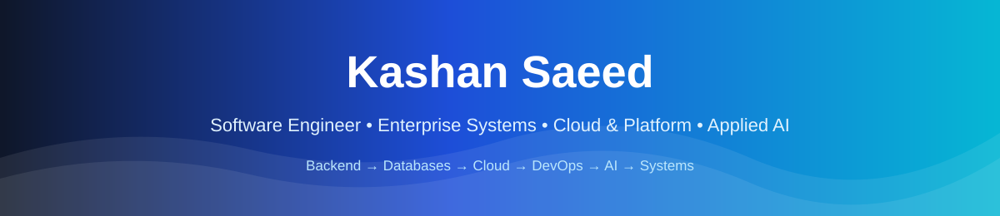
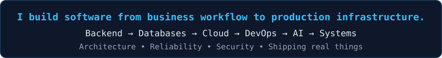
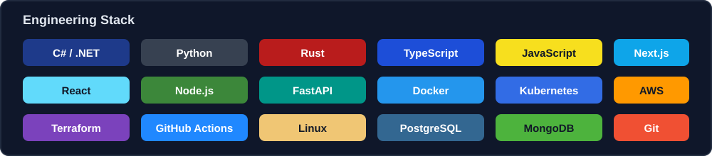
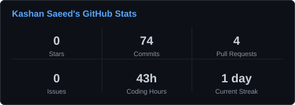
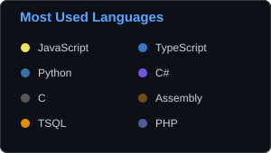
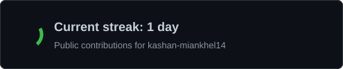

<div align="center">

[](https://www.linkedin.com/in/kashan-saeed-942548375)
[](mailto:kashan.miankhel@gmail.com)
[](https://github.com/kashan-miankhel14)
[](https://tryhackme.com/p/kashanmiankhel922)
[](https://app.hackthebox.com/profile/kashansaeed14)

<br/>



</div>

---

## `whoami`

I am a **Software Engineering graduate from FAST NUCES** focused on building systems that connect **business logic, backend engineering, databases, infrastructure, automation, and applied AI**.

My strongest work sits at the intersection of **enterprise software and platform engineering**: .NET and SQL Server business applications, cloud-native microservices, CI/CD and container platforms, Rust systems tooling, full-stack products, and AI features that operate inside real workflows.

I like understanding the whole system — not just one endpoint or one screen.

```text
Business Problem
      ↓
Domain / Workflow
      ↓
Backend + APIs
      ↓
SQL / Data
      ↓
Containers + CI/CD
      ↓
Cloud / Platform
      ↓
Observability + Security
      ↓
AI where it genuinely adds value
```

### What I bring

- **Enterprise engineering:** .NET, SQL Server, stored procedures, reporting, reconciliation, business workflows
- **Backend & distributed systems:** REST APIs, microservices, auth, messaging/realtime patterns, service boundaries
- **Cloud & DevOps:** Docker, Kubernetes, GitHub Actions, AWS architecture, Helm, Terraform, Ansible, monitoring
- **Systems engineering:** Rust, async execution, DAG scheduling, Docker orchestration, gRPC, WebSockets, caching
- **Applied AI:** RAG, local LLMs, agent/tool workflows, NLP prioritization, forecasting pipelines
- **Security mindset:** authentication, authorization, secret handling, mTLS/HMAC, secure configuration, static analysis

---

## ⚙️ Engineering Stack

<div align="center">



<br/><br/>


</div>

---

# 🚀 Featured Engineering

<table>
<tr>
<td width="50%" valign="top">

### ⚡ [RustPipe](https://github.com/kashan-miankhel14/RusPipe)
**Self-hosted CI/CD pipeline engine in Rust**

Pipeline-as-code with local and Docker execution, DAG-based scheduling, live WebSocket logs, persistence, artifact caching, secret masking, GitHub status checks, and distributed runner work with gRPC/mTLS.

`Rust` `Tokio` `Docker` `Axum` `WebSockets` `SQLite` `gRPC` `mTLS`

</td>
<td width="50%" valign="top">

### 🏢 [PMT](https://github.com/kashan-miankhel14/pmt-internship)
**Enterprise project-management platform**

.NET Clean Architecture API with SQL Server/Dapper, secure authentication, migrations, SignalR, Next.js client, testing, configuration hardening, and an AI/RAG integration boundary.

`.NET` `C#` `SQL Server` `Dapper` `Next.js` `SignalR` `RAG`

</td>
</tr>
<tr>
<td width="50%" valign="top">

### ☁️ [FairGig](https://github.com/kashan-miankhel14/FairGig)
**Cloud-native microservices + DevOps platform**

Seven-service application with FastAPI/Node services, Dockerized local orchestration, GitHub Actions CI, Kubernetes/Helm assets, AWS infrastructure work, and Prometheus/Grafana observability configuration.

`Microservices` `Docker` `Kubernetes` `AWS` `GitHub Actions` `Helm`

</td>
<td width="50%" valign="top">

### 💬 [ULink](https://github.com/kashan-miankhel14/ulink-internship)
**Full-stack communication/workspace product**

Internship repository combining a Next.js web application and .NET MAUI mobile client, with MongoDB-backed application features, authentication, realtime/event patterns, file workflows, and production-minded project organization.

`Next.js` `.NET MAUI` `MongoDB` `Firebase` `Realtime` `Full Stack`

</td>
</tr>
<tr>
<td width="50%" valign="top">

### 🤖 [AutoReturn](https://github.com/kashan-miankhel14/AutoReturn)
**Desktop AI productivity system**

Co-developed AI intelligence hub with message/task prioritization, NLP-based scoring, local-model integration, automation workflows, and productivity-oriented backend logic.

`Python` `PySide6` `NLP` `Ollama` `Automation` `AI`

</td>
<td width="50%" valign="top">

### 📈 [Pharma Demand Forecasting](https://github.com/kashan-miankhel14/pharma-demand-forecasting-internship)
**Production-shaped ML forecasting pipeline**

Validated monthly aggregation, leakage-aware multi-horizon forecasting with LightGBM, feature engineering, CLI tooling, synthetic test data, and a FastAPI serving layer.

`Python` `LightGBM` `FastAPI` `Forecasting` `Feature Engineering`

</td>
</tr>
</table>

---

## 🧭 How I Think About Engineering

<table>
<tr>
<td align="center" width="25%"><b>01</b><br/><b>Understand the domain</b><br/><sub>Model the real workflow before writing abstractions.</sub></td>
<td align="center" width="25%"><b>02</b><br/><b>Design clear boundaries</b><br/><sub>Keep business logic, data, infrastructure, and integrations understandable.</sub></td>
<td align="center" width="25%"><b>03</b><br/><b>Automate delivery</b><br/><sub>Build, test, containerize, observe, and secure the path to production.</sub></td>
<td align="center" width="25%"><b>04</b><br/><b>Use AI deliberately</b><br/><sub>Integrate intelligence into systems where it improves the workflow.</sub></td>
</tr>
</table>

---

## 💼 Experience Snapshot

### **Software Engineering Intern — UDL Distribution (Pvt.) Ltd.** `2026`
Worked across **enterprise reporting, SQL Server, .NET applications, FBR/tax reconciliation, project-management tooling, communication software, CI/CD, and internal AI/RAG experimentation**.

Selected work included:
- Building and debugging SQL Server reporting logic and stored procedures tied to operational sales workflows
- Working on .NET business applications and production-facing enterprise processes
- Designing reconciliation workflows for company and FBR taxation data
- Contributing to PMT and ULink full-stack systems
- Exploring RAG/local-model integration over enterprise data and workflow actions

### **Backend Developer Intern — DevsInc** `2025–2026`
Worked with **Python backend development, AI-agent patterns, Google Ads API integrations, API endpoints, and Logfire telemetry/observability**.

---

## 🧩 More Projects & Technical Work

<details>
<summary><b>Open the broader engineering portfolio</b></summary>
<br/>

| Area | Repository | What it demonstrates |
|---|---|---|
| Microservices | [9-Micorservices-BookStore](https://github.com/kashan-miankhel14/9-Micorservices-BookStore) | Service decomposition, APIs, containers, orchestration concepts |
| Systems / Linux | [rustwatch](https://github.com/kashan-miankhel14/rustwatch) | Rust systems experimentation and Linux-oriented tooling |
| Enterprise SQL | [SQL Reporting & Reconciliation](https://github.com/kashan-miankhel14/sql-reporting-reconciliation-internship) | Reporting logic, SQL workflow analysis, reconciliation |
| Tax / ERP | [FBR SQL Reconciliation](https://github.com/kashan-miankhel14/fbr-sql-reconciliation-internship) | Enterprise reconciliation and taxation data workflows |
| Legacy Systems | [UNIX V6 Technical Assessment](https://github.com/kashan-miankhel14/Unix-v6src) | Static analysis, architecture assessment, technical debt and modernization analysis |
| Kubernetes | [Kubernetics](https://github.com/kashan-miankhel14/Kubernetics) | Kubernetes learning and orchestration exercises |
| Containers | [Docker](https://github.com/kashan-miankhel14/Docker) | Docker-focused implementation and learning work |
| Full Stack | [TaskFlow](https://github.com/kashan-miankhel14/TaskFlow) | Application architecture and frontend/backend integration |
| Product / Design | [PharmaScan Design](https://github.com/kashan-miankhel14/pharmascan-design-internship) | Design and product-analysis work |
| Supplier Systems | [DBSV2 Supplier App](https://github.com/kashan-miankhel14/dbsv2-supplier-app-internship) | Supplier-system analysis and product/process thinking |

</details>

---

## 🛡️ Security Foundation

Security is part of how I build software rather than a separate identity I bolt on later.

- **ISC2 Certified in Cybersecurity (CC)**
- Training/labs across **TryHackMe** and **Hack The Box**
- Practical familiarity with **Nmap, Burp Suite, Wireshark, Metasploit, FFUF/Gobuster**
- Secure engineering work involving **JWT/auth boundaries, secret handling, HMAC verification, RBAC concepts, mTLS, configuration validation, static analysis, and security documentation**

<details>
<summary><b>Security learning repositories</b></summary>
<br/>

- [Jr-Penetration-testing](https://github.com/kashan-miankhel14/Jr-Penetration-testing)
- [Bug-Bounty-Hackthebox](https://github.com/kashan-miankhel14/Bug-Bounty-Hackthebox)
- [Intro-To-Penetration-Testing_HackTheBox](https://github.com/kashan-miankhel14/Intro-To-Penetration-Testing_HackTheBox)
- [Introduction-to-CyberSecurity-ISC2](https://github.com/kashan-miankhel14/Introduction-to-CyberSecurity-ISC2)
- [Linux-Fudamentals_Hack-the-Box](https://github.com/kashan-miankhel14/Linux-Fudamentals_Hack-the-Box)

</details>

---

## 🎓 Education & Credentials

**BS Software Engineering — FAST NUCES**  
Software engineering, architecture, distributed systems, databases, software re-engineering, cloud/DevOps, security, and applied AI project work.

**ISC2 Certified in Cybersecurity (CC)**

---

## 📊 GitHub

<div align="center">




<br/>



</div>

---

## 🎯 Roles I’m Built For

<div align="center">


</div>

I am especially interested in teams where I can grow across **enterprise/backend engineering, cloud infrastructure, platform/DevOps, and intelligent systems** rather than being boxed into a single tool.

---

<div align="center">

### Build systems. Understand the business. Automate the boring parts. Keep the architecture honest.

**Pakistan 🇵🇰 · Open to engineering opportunities and serious technical collaboration**

<br/>

[](https://www.linkedin.com/in/kashan-saeed-942548375)
[](mailto:kashan.miankhel@gmail.com)

</div>


